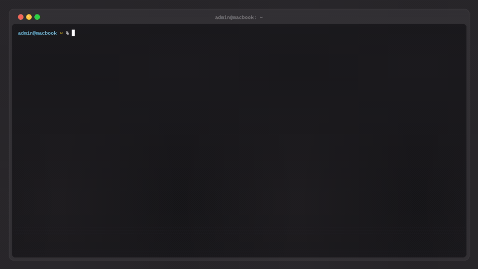

# hermes-plugin-openalex

[OpenAlex](https://openalex.org) tools for [Hermes Agent](https://github.com/NousResearch/hermes-agent). Look up works, authors, sources, and institutions. A session budget refuses a call before it is sent.

No API key required. Anonymous traffic gets $0.10/day. A free key gets $1.00/day. Identifier lookups and name resolution are $0 and still work when the daily budget is gone. The snapshot stays free. You pay OpenAlex only after the daily allowance, if you buy prepaid usage or a plan.

```bash
hermes plugins install Adolanium/hermes-plugin-openalex --enable
```

```bash
hermes plugins remove openalex
```

Install clones the plugin, optionally prompts for `OPENALEX_API_KEY`, writes it to `~/.hermes/.env`, and enables it. Restart the gateway if one is running. Hermes registers the tools on every frontend that shares the tool registry (desktop, CLI, TUI, gateway, ACP, cron).

---

## Demo

Search, `get` of metadata, then a fulltext probe that does not download. Hermes CLI.



[mp4](https://github.com/Adolanium/hermes-plugin-openalex/releases/download/demo/demo.mp4)

---

## Try it

Key optional. Free calls work without one.

```bash
hermes openalex search "machine learning neuroimaging scikit-learn" --limit 5
hermes openalex get 10.3389/fninf.2014.00014
hermes openalex fulltext 10.3389/fninf.2014.00014
# $0.01, downloads text:
# hermes openalex fulltext 10.3389/fninf.2014.00014 --confirm
hermes openalex doctor
```

Captured once. Index counts move.

| Call | What came back | Cost |
|---|---|---:|
| `search … --limit 5` | 16 matches, 5 shown, top hit 2,675 cites | $0.001 |
| `get 10.3389/fninf.2014.00014` | metadata (title, year, venue, OA, authors) | $0 |
| `fulltext` without `--confirm` | `available true`, formats grobid_xml + pdf | $0 |
| `fulltext --confirm` | downloads text | $0.01 |

```
$ hermes openalex search "machine learning neuroimaging scikit-learn" --limit 5
16 matches, showing 5
  year    cites    title
  2014    2,675    Machine learning for neuroimaging with scikit-learn
  ...
this call $0.0010 (search)
```

```
$ hermes openalex fulltext 10.3389/fninf.2014.00014
┌───────────────────── fulltext ──────────────────────┐
│ Machine learning for neuroimaging with scikit-learn │
│ W2151591509                                         │
└─────────────────────────────────────────────────────┘
  available   true
  formats     grobid_xml, pdf
  download    $0.0100 only with --confirm

  Nothing was downloaded and nothing was spent.
this call $0.0000 (singleton)
```

`get` is a catalog record, not the PDF. `fulltext` without `--confirm` only asks whether OpenAlex holds the text. `--confirm` is the download.

---

## OpenAlex prices (February 2026)

The API is usage-priced in dollars by call shape. [OpenAlex announcement](https://blog.openalex.org/openalex-api-new-features-and-usage-based-pricing/). Data snapshot remains free.

| Call | Price | Calls in a $0.10 anonymous day |
|---|---:|---:|
| Fetch by id, prefixed form | $0 | unlimited |
| Autocomplete | $0 | unlimited |
| List, filter, or `group_by` | $0.0001 | 1,000 |
| Search | $0.001 | 100 |
| Text classification or fulltext download | $0.01 | 10 |

A query with `group_by` is billed as a list call even when a search term is present. That is OpenAlex's price table, not a plugin discount. `count` returns totals and groups. `search` returns records. They are different responses.

OpenAlex bills $0.0001 on a rejected 400. The plugin predicts cost from the call shape and refuses locally when the session budget would be exceeded, so that refusal is not sent and is not billed. A 400 that does go out is still billed.

OpenAlex returns 429 for both a short throttle and a spent daily budget. During a throttle, `X-RateLimit-Remaining` can be 0 while budget remains. `Retry-After` is the field that distinguishes them: about a second versus tens of thousands (until midnight UTC). The plugin retries the first and does not retry the second.

Captured at zero daily balance:

```
error_kind: budget_exhausted
http      : 429
details   : {"retry_after_seconds": 42549.0, "cost_required_usd": 0.0001}
next_step : The OpenAlex daily budget is spent and refills at midnight UTC.
            Do not retry this call. ID lookups (openalex_get) and name
            resolution (openalex_resolve) are free and still work...
```

In that state, `openalex_get`, `openalex_resolve`, and `openalex_fields` still returned data.

---

## What `get` returns

`openalex_get` fetches metadata. Default verbosity is `summary`: id, title, year, venue, citation count, OA status, topic, and up to ten authors plus `author_count`. It does not include the abstract (`detail` does). It does not download the paper.

`select` only accepts top-level fields, so it cannot trim inside `authorships`. The plugin caps the author list after the response arrives. `concepts` is dropped (deprecated, replaced by `topics`). Abstracts arrive as an inverted index. The plugin reconstructs the sentence when `reconstruct_abstracts` is on.

Measured 2026-08-13 on `doi:10.7717/peerj.4375` (W2741809807):

```
OpenAlex response body     31,468 characters
plugin summary record       1,855 characters
plugin detail record        (abstract + topics + keywords added)
```

An earlier capture of the same work was 33,475 / 1,921. The index moves.

A separate collaboration work was measured at 2.88 MB raw, 93% one author list.

---

## Tools

One `openalex` toolset, free tools first.

### core (default)

| Tool | Returns | Price |
|---|---|---|
| `openalex_resolve` | Name to id, plus the filter key for the next call | $0 |
| `openalex_get` | Metadata by OpenAlex id, DOI, ORCID, ROR, ISSN, or PMID. Up to 20 ids | $0 |
| `openalex_fulltext` | Availability, or text if `confirm` is set | $0 probe / $0.01 download |
| `openalex_fields` | Valid filter and select names, from disk | $0 |
| `openalex_account` | Daily budget and session ledger | $0 |
| `openalex_count` | Total, optional `group_by` breakdown | $0.0001 |
| `openalex_related` | cited_by, references, or related works | $0.0001 |
| `openalex_search` | Record list (`per_page` default 25, max 200) | $0.001 |

### full (`hermes openalex profile full`)

| Tool | Returns |
|---|---|
| `openalex_harvest` | Cursor pages up to `max_records`. Cost is estimated first and the call is refused if the session budget cannot cover it |
| `openalex_classify` | Topics for arbitrary text. $0.01. Off until `allow_text_classification: true` |

`openalex_classify` is hidden by default. Ten calls spend a $0.10 anonymous day. If the work is already in OpenAlex, `get` already has topics.

---

## Examples

Captured output.

### Resolve

```
$ hermes openalex resolve "bengio" --entity authors
'bengio'  (free)
  id            name              type    works   hint
  A5086198262   Yoshua Bengio     author  1,290   Mila / Université de Montréal
  A5017529415   Samy Bengio       author  391
```

Filter on the id for an exact author. A name search also matches acknowledgements and reference strings.

### Count

```
$ hermes openalex count --search "graph neural network" --group-by publication_year
887,992 works
publication_year
  value      count
  2025     134,581
  2024     134,292
  2023     129,716
  ...
this call $0.0001 (list)   session $0.0001 of $0.0500
```

That capture used OpenAlex's default (full-text) search. A later `title_and_abstract` run of the same string returned 101,610 works. `count` is $0.0001. `search` of the same string is $0.001 and returns a page of records (`per_page`, default 25).

### `get` payload (summary)

```json
{
  "ok": true,
  "record": {
    "id": "W2741809807",
    "doi": "10.7717/peerj.4375",
    "title": "The state of OA: a large-scale analysis of the prevalence and impact of Open Access articles",
    "year": 2018,
    "type": "article",
    "cited_by_count": 1241,
    "authors": [
      {"name": "Heather Piwowar", "id": "A5048491430", "institutions": ["Impactstory"]}
    ],
    "author_count": 9,
    "venue": "PeerJ",
    "open_access": "gold",
    "topic": "Scholarly Communication"
  },
  "cost": {"this_call_usd": 0.0, "price_class": "singleton", "spent_usd": 0.0}
}
```

The snippet above is shortened for the README. Live summary size for this work is in the table earlier.

### Spent daily budget

```json
{
  "ok": false,
  "error": "Insufficient budget. This request costs $0.0001 but you only have $0.0000 remaining.",
  "error_kind": "budget_exhausted",
  "http_status": 429,
  "details": {"retry_after_seconds": 42549.0, "cost_required_usd": 0.0001},
  "next_step": "The OpenAlex daily budget is spent and refills at midnight UTC. Do not retry this call. ID lookups (openalex_get) and name resolution (openalex_resolve) are free and still work at zero budget, so use those. A free API key raises the daily budget from $0.10 to $1.00."
}
```

---

## Configuration

Under `plugins.entries.openalex`. Defaults work.

```yaml
plugins:
  enabled: [openalex]
  entries:
    openalex:
      profile: core            # core | full
      verbosity: summary       # summary | detail | raw
      max_result_chars: 24000
      rate_limit_per_second: 8 # API ceiling is 10/s
      timeout_seconds: 30
      retries: 2
      reconstruct_abstracts: true

      cache:
        enabled: true
        ttl_seconds: 3600
        max_entries: 512

      budget:
        usd_per_session: 0.05          # 500 list/count calls, or 50 searches
        allow_text_classification: false

      tools:
        enabled: []
        disabled: []
```

`OPENALEX_API_KEY` is sent as a Bearer header. The documented query-parameter form is the fallback.

---

## Terminal

```bash
hermes openalex doctor
hermes openalex prices
hermes openalex budget
hermes openalex resolve "eth zurich" --entity institutions
hermes openalex get 10.7717/peerj.4375
hermes openalex fulltext 10.3389/fninf.2014.00014
hermes openalex fulltext 10.3389/fninf.2014.00014 --confirm
hermes openalex count --filter 'is_oa:true,publication_year:2024' --group-by 'open_access.oa_status'
hermes openalex search "protein folding" --limit 10
hermes openalex profile full
hermes openalex cache stats
```

`doctor` checks the plugin is enabled, makes one free request so a missing key and a dead network stay distinguishable, prints the live budget and reset time, and refreshes prices from the account headers.

---

## In conversation

```
/openalex W2741809807         fetch a work by id           $0
/openalex 10.7717/peerj.4375  fetch by DOI                 $0
/openalex bengio              resolve a name to an id      $0
/openalex budget              session spend and balance    $0
```

Slash only runs those free paths. Count and search go through the agent tools.

---

## Skills

- `openalex:query-syntax` — filters, grouping cap, identifier forms, prices. A rejected filter is still billed.
- `openalex:lit-review` — order of calls (anchor, size, shape, traverse, retrieve), plus citation-age bias, author merge errors, and coverage gaps.

---

## Development

```bash
git clone https://github.com/Adolanium/hermes-plugin-openalex
cd hermes-plugin-openalex
pytest tests
```

104 tests. None call the API. Use `pytest tests`, not bare `pytest`: Hermes needs `__init__.py` at the plugin root, so pytest would otherwise import that file as a package. `tests/pytest.ini` pins rootdir.

`tests/conftest.py` loads the plugin the way `hermes_cli/plugins.py` does (`hermes_plugins.openalex` with a synthetic parent).

No extra pip dependencies. `httpx`, `rich`, and `pyyaml` already ship with Hermes.

The HTTP client is a thin `httpx` layer so `X-RateLimit-*` headers stay available. pyalex drops the response object after parse, and retries every 429, including a spent daily budget.

---

## Known limits

Semantic search currently returns HTTP 500, so it is not exposed. The n-grams endpoint was removed and now returns the plain work object with no error. Above a few hundred thousand records the free snapshot at `s3://openalex` is cheaper and faster than paging the API.

## License

MIT. See [LICENSE](LICENSE).
